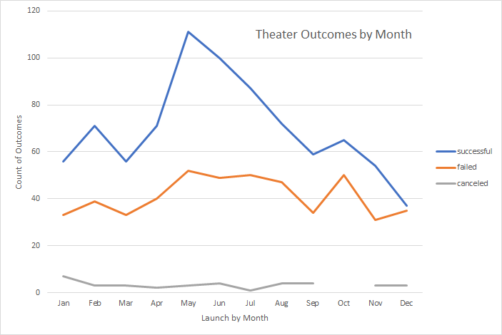

# kickstarter-analysis
---
## Overview of Project
The client, Louise, is an up-and-coming playwright who crowdfunded her latest play, "Fever". Using data from previous crowdfunding campaigns, she came very close to meeting her funding goal. She would like to finetune the data to be able to conduct an even more successful crowdfunding campaign for her next play.
---
### Purpose
Using data from previous crowdfunding campaign, we need to determine how different campaigns fare in relation to their launch dates and their funding goals. This information will subsequently be used to help plan the next crowdfunding campaign.
---
## Analysis and Challenges
The spreadsheet used: [Kickstarter challenge](Kickstarter_Challenge.xlsx)
---
### Analysis of Outcomes Based on Launch Date

To determine whether the launch date has an effect on the campaign's success, a pivot table was created from the source data. The launch date was modified to show the campaign's launch month. In addition, live fundraisers were considered out of scope as we do not know yet the final outcome. They were then filtered out so that only successful, failed, or canceled outcomes could appear. A line chart was used to visually trend the different number of outcomes over the months of the year.

---
### Analysis of Outcomes Based on Goals

To determine if the goal of a campaign has an impact on its outcome, we again used the previously collected kickstarter data. In this case, we categorized the goals in buckets (1000 to 50000 in increments of 5000) and filtered the outcome of each play based on these buckets. We then calculated the percentage of the outcome based on the total number of projects in order to standardize the data.

---
### Challenges and Difficulties Encountered

The first difficulty was extracting the month from the date created conversion column in the Theater Outcomes by Launch date spreadsheet. Once the year was removed from the Rows field, I was able to show the month of launch in the pivot table. The second difficulty was selecting the appropriate columns and assigning the appropriate criteria to them, so that the data could be filtered correctly in the Outcomes Based on Goals spreadsheet. I needed to freeze the columns by using the <$> symbol to calculate the correct number of outcomes for each goal bucket.

---
## Results

- What are two conclusions you can draw about the Outcomes based on Launch Date?

The summer months (May, June, July) seem to be the best months to conduct a campaign as we see a peak in the chart during this period. The data also seems to suggest that the period between Oct, Nov, Dec, and Jan are not the best to launch a crowdfunding initiative. We can see a peak in the percentage of failed campaigns and a dip in the percentage of successful ones.

- What can you conclude about the Outcomes based on Goals?

The data suggests that campaigns with goals between 35000 and 44999 have the most successful outcomes. A goal that is too high (greater than 45000) is prone to failure.

- What are some limitations of this dataset?

It should be noted that Outcomes based Launch date encompasses different types of theater endpoints such as musicals, plays, and spaces, whereas the Outcomes based on Goals chart only takes into account plays. The client should take caution when comparing these charts with each other. In addition, the Outcomes Based on Goals chart does not standardize the goals to one type of currency. We would need to create this same chart by country to provide a better window into the different outcomes. Finally, it is worth noting that these charts do not provide us with any information on the length of the campaign, the number of backers, or the amount pledged. These different criteria could potentially provide slightly different evaluations. 

- What are some other possible tables and/or graphs that we could create?

It would be interesting to see the outcomes based on the country using perhaps a bar chart. It would also be useful to know the number of backers and how much they pledged for successful campaigns vs failed campaigns. We could also compare the box plots of goals and pledged to determine any potential outliers and if there are any differences between these two criteria.

---
