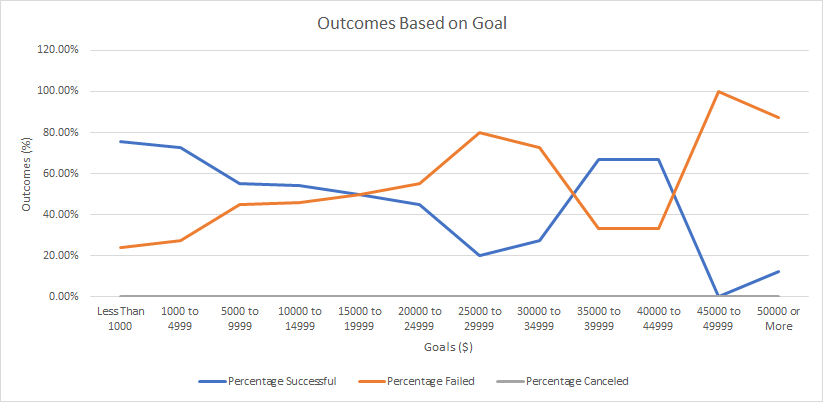

# kickstarter-analysis
---
## Overview of Project

---
### Purpose
To determine how different campaigns fare in relation to their launch dates and their funding goals.
---
## Analysis and Challenges
[Kickstarter challenge](data-1-1-3-StarterBook.xlsx)
---
### Analysis of Outcomes Based on Launch Date

---
### Analysis of Outcomes Based on Goals

---
### Challenges and Difficulties Encountered

---
## Results

- What are two conclusions you can draw about the Outcomes based on Launch Date?

- What can you conclude about the Outcomes based on Goals?

- What are some limitations of this dataset?

- What are some other possible tables and/or graphs that we could create?

---
